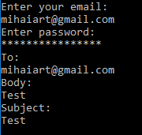

# Laboratory Work nr.4
## SMTP/POP3 protocols
*_SMTP_*(Simple Mail Transfer Protocol) is a simple ASCII protocol. SMTP works in this way: After establishing TCP connection to port 25, the client machine waits for the receiving machine operating. The receiving machine starts by sending a line of text giving its identity
and telling whether it is prepared to receive mail. If it's not, then the  client releases the connection and tries again later.
Otherwise, the client announces whom the email is coming from and whom it is going to. If such a recipient exists at the destination, the server gives the client the go-ahead to send the message. Then the client sends the message and the server acknowledges it.

*_POP3_*(Post Office Protocol, version 3) is a simple protocol but supports fewer features and is less secure in typical usage.Mail is
usually downloaded to the user agent computer, instead of remaining on the mail server. This makes life easier on the server, but harder on the user. It is not easy to read mail on multiple computers, plus if the user agent computer breaks, all email may be lost permanently.

For sending messages using SMTP, I hacve used *SmtpClient* and for  creating the mail message *MailMessage* , for adding the message to the mail *AlternateView* and *LinkedResource* were used 
   
   
  
 For Studying POP3 , I downloaded *OpenPop.Net* from Nuget, and created a function that takes the headers of a certain number of mail messages
    

 ```csharp
  public Dictionary<int, string> Pop3(int messageNr)
        {
            Dictionary<int, string> headers = new Dictionary<int, string>();

            using (Pop3Client client = new Pop3Client())
            {
                client.Connect  ("pop.gmail.com", 995, true);
                client.Authenticate(MailAddress, Password);
                for (int i = 1; i <= messageNr; i++)
                {
                    var header = client.GetMessageHeaders(i);
                    RfcMailAddress from = header.From;
                    string subject = header.Subject;
                    headers.Add(i, " Subject: " + header.Subject + "\n From: " + header.From +"\n DateSent: " + header.DateSent);
                }
            }

            return headers;
        }
     ``` 
    
     


  
