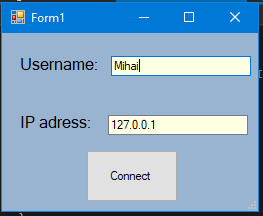
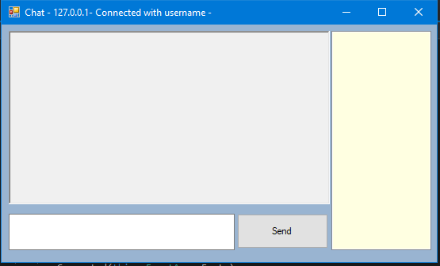
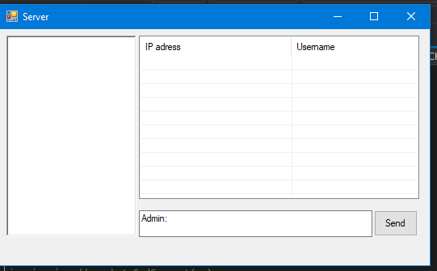

# Laboratory Work nr.5
## Sockets. TCP/IP and UDP Protocols  
1.*TCP* – is for connection orientated applications. It has built in error checking and will re transmit missing packets.     
2.*UDP* – is for connection less applications. It has no has built in error checking and will not re transmit missing packets.     
After a connection between the server and client, i.e., the server process and the client process is established, 
they can communicate for the purpose of exchanging data using sockets.A socket is the end point of a bi-directional communication
between two processes running over a network.       
In C# in order to use the TCP Protocol you  declare a socket in this way:     
*var _socket = new Socket(AddressFamily.InterNetwork, SocketType.Stream, ProtocolType.Tcp);*      
In case of UDP Protocol:      
*var _socket = new Socket(AddressFamily.InterNetwork, SocketType.DGram, ProtocolType.Udp);*      
Also in case of UDP you don't have to use BeginAccept, but theoretically the main difference between these two types of protocols is:
When an app uses UDP, packets are just sent to the recipient. The sender doesn’t wait to make sure the recipient received the packet—it 
just continues sending the next packets. If the recipient misses a few UDP packets here and there, they are just lost—the sender won’t 
resend them.     
In this laboratory work, I used an example from the internet, so finally using that tutorial, I obtained a group chat,where admin can also 
make a private chat with users he want. In order to treat the Connection, sendMessage, DisconnectUser or MakePrivateChat commands, while performing 
an action, we form the message in this form "Connect|Client1", "SendMessage|Admin|MessageText" etc.     
Let's talk about the process when admin sends a message, we make a for loop to iterate through all sockets and send the message to each endpoint.  
   
   
    

Bibliography:  
https://www.codeproject.com/Articles/16935/A-Chat-Application-Using-Asynchronous-UDP-sockets

